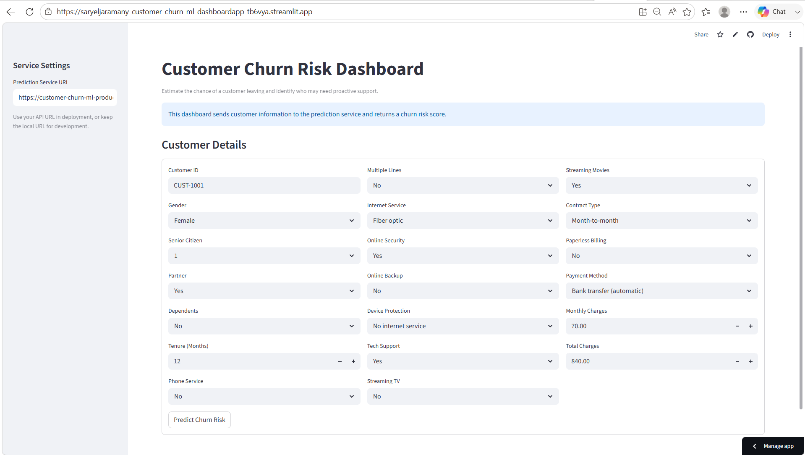
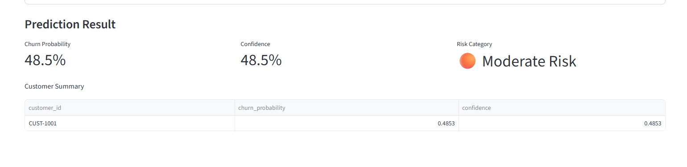

# Customer Churn Prediction — End-to-End ML System

A production-style machine learning system that predicts customer churn for a telecom provider. Built as a fully modular Python package with a REST API, interactive dashboard, Docker containerization, and cloud deployment on Railway.

---

## Live Demo

| Service | URL |
|---|---|
| Dashboard | https://saryeljaramany-customer-churn-ml-dashboardapp-tb6vya.streamlit.app/ |
| API | customer-churn-ml-production.up.railway.app |
| API Docs | https://customer-churn-ml-production.up.railway.app/docs |
| Health Check | https://customer-churn-ml-production.up.railway.app/health |

---

# Customer Churn Prediction — End-to-End ML System


A production-style machine learning system that predicts...

---

## Project Summary

Customer churn — when a customer stops using a service — is one of the most costly problems in subscription businesses. This project builds a complete ML system that ingests raw Telco customer data, preprocesses and encodes it, trains and evaluates multiple classifiers, and serves real-time churn probability predictions through a REST API backed by an interactive Streamlit dashboard.

The goal was not just to train a model, but to build a system that mirrors real-world ML engineering: modular code, reproducible pipelines, versioned artifacts, containerized deployment, and a live serving layer.

---

## System Architecture

```
┌─────────────────────────────────────────────────────────────┐
│                        Data Layer                           │
│  Raw CSV  →  Preprocessor  →  Scaler  →  Cleaned Features  │
└─────────────────────────┬───────────────────────────────────┘
                          │
┌─────────────────────────▼───────────────────────────────────┐
│                     Training Pipeline                        │
│   Logistic Regression  │  Random Forest  →  Best by AUC    │
│   Model + Scaler + Preprocessor + Feature Names → .pkl     │
└─────────────────────────┬───────────────────────────────────┘
                          │
┌─────────────────────────▼───────────────────────────────────┐
│                     Serving Layer                            │
│                                                             │
│   ┌─────────────────┐        ┌──────────────────────────┐  │
│   │  Streamlit      │  HTTP  │  FastAPI                 │  │
│   │  Dashboard      │◄──────►│  /predict                │  │
│   │  (Streamlit     │        │  /health                 │  │
│   │   Cloud)        │        │  /meta                   │  │
│   └─────────────────┘        └──────────┬───────────────┘  │
│                                         │                   │
│                              ┌──────────▼───────────────┐  │
│                              │  predict_churn()         │  │
│                              │  → load artifacts        │  │
│                              │  → preprocess input      │  │
│                              │  → scale features        │  │
│                              │  → model.predict_proba() │  │
│                              └──────────────────────────┘  │
└─────────────────────────────────────────────────────────────┘
                          │
┌─────────────────────────▼───────────────────────────────────┐
│                     Deployment                               │
│         Docker Image → Railway (API) + Streamlit Cloud      │
└─────────────────────────────────────────────────────────────┘
```

---

## Key Features

- **Modular `src/` package** — all business logic lives in an installable Python package, fully separated from notebooks and API code
- **Reproducible preprocessing** — a fitted `Preprocessor` object handles encoding at both training and inference time, eliminating training-serving skew
- **No data leakage** — scaler is fit on training data only and applied to test data separately
- **Cross-platform artifact loading** — custom unpickler handles `WindowsPath`/`PosixPath` deserialization across operating systems
- **REST API with validation** — FastAPI with Pydantic schema validation, CORS support, and structured error handling
- **Health monitoring** — `/health` endpoint verifies all four model artifacts are present before reporting ready
- **Interactive dashboard** — Streamlit UI with per-customer form input and risk categorization
- **Containerized deployment** — Dockerfile packages model artifacts and API into a single deployable image
- **Auto-deploy pipeline** — every push to `main` triggers a Railway redeploy

---

## Tech Stack

| Layer | Technology |
|---|---|
| Language | Python 3.10+ |
| ML | scikit-learn (Logistic Regression, Random Forest) |
| Data | pandas, numpy |
| API | FastAPI, Uvicorn, Pydantic |
| Dashboard | Streamlit |
| Packaging | setuptools, pyproject.toml, editable install |
| Containerization | Docker |
| API Deployment | Railway |
| Dashboard Deployment | Streamlit Community Cloud |
| Testing | pytest |
| Linting | Ruff |

---

## Project Structure

```
customer-churn-ml/
├── api/
│   └── api.py                    # FastAPI app — /predict, /health, /meta
├── dashboard/
│   ├── app.py                    # Streamlit dashboard
│   └── requirements.txt          # Lightweight dashboard dependencies
├── data/
│   ├── raw/                      # Original Telco CSV (gitignored)
│   └── processed/                # Cleaned features, splits (gitignored)
├── model/                        # Saved .pkl artifacts (committed for deployment)
│   ├── churn_model.pkl
│   ├── preprocessor.pkl
│   ├── scaler.pkl
│   └── feature_names.pkl
├── notebooks/
│   ├── research_notebook.ipynb   # EDA and original exploration
│   └── Engineering_Pipeline.ipynb # Clean, package-driven pipeline run
├── src/
│   └── customer_churn_ml/        # Installable Python package
│       ├── __init__.py           # Public API surface
│       ├── config.py             # Centralized paths and hyperparameters
│       ├── constants.py          # Domain constants (column names, orderings)
│       ├── predict.py            # Inference entry point
│       ├── utils.py              # Logging, pickle I/O, validation helpers
│       ├── data/
│       │   └── loader.py         # CSV loading with column validation
│       ├── preprocessing/
│       │   ├── preprocessor.py   # Fit/transform pipeline (encoding, cleaning)
│       │   └── scalar.py         # StandardScaler wrapper with save/load
│       ├── training/
│       │   ├── trainer.py        # Model training, selection, artifact saving
│       │   └── evaluator.py      # Metrics, ROC curves, comparison table
│       └── interpret/
│           └── feature_importance.py  # RF importances and LR coefficients
├── tests/                        # pytest test suite
├── Dockerfile
├── pyproject.toml
└── README.md
```

---

## ML Pipeline

### 1. Preprocessing (`preprocessing/preprocessor.py`)

The `Preprocessor` class is fit once on training data and reused at inference:

- Drops the customer ID column
- Coerces `TotalCharges` to numeric and fills missing values with the training median
- Encodes the binary target (`Churn` → `Churn_Yes`)
- One-hot encodes low-cardinality categoricals (`drop_first=True`)
- Frequency-encodes high-cardinality categoricals
- Saves the fitted object as `preprocessor.pkl`

### 2. Scaling (`preprocessing/scalar.py`)

A `NumericScaler` wraps `StandardScaler` and enforces fit-on-train-only:

- Fit on `X_train` only — never on test data
- Applied separately to `X_train` and `X_test`
- Saved as `scaler.pkl` for inference

### 3. Training (`training/trainer.py`)

`ModelTrainer` trains all candidate models, evaluates each, and selects the best:

- Trains Logistic Regression and Random Forest
- Evaluates using accuracy, F1, ROC-AUC, confusion matrix, and classification report
- Selects the best model by ROC-AUC
- Saves `churn_model.pkl` and `feature_names.pkl`

### 4. Evaluation (`training/evaluator.py`)

- Per-model classification reports
- ROC curve comparison plot
- Sortable comparison table

---

## How Predictions Work

At inference time, `predict_churn()` in `predict.py` runs the following pipeline:

```
Raw customer CSV
      │
      ▼
preprocessor.transform()     ← fitted Preprocessor loaded from .pkl
      │
      ▼
scaler.transform()           ← fitted StandardScaler loaded from .pkl
      │
      ▼
feature alignment            ← reorder columns to match feature_names.pkl
      │
      ▼
model.predict_proba()        ← trained classifier loaded from .pkl
      │
      ▼
DataFrame: customer_id | churn_probability | confidence
```

The preprocessor and scaler are always loaded from the same artifacts used during training, ensuring identical feature transformations at inference.

---

## API Endpoints

### `POST /predict`

Accepts one or more customer records and returns churn probabilities.

**Request body:**
```json
{
  "customers": [
    {
      "customerID": "CUST-1001",
      "gender": "Female",
      "SeniorCitizen": 0,
      "Partner": "Yes",
      "Dependents": "No",
      "tenure": 12,
      "PhoneService": "Yes",
      "MultipleLines": "No",
      "InternetService": "Fiber optic",
      "OnlineSecurity": "No",
      "OnlineBackup": "No",
      "DeviceProtection": "No",
      "TechSupport": "No",
      "StreamingTV": "Yes",
      "StreamingMovies": "Yes",
      "Contract": "Month-to-month",
      "PaperlessBilling": "Yes",
      "PaymentMethod": "Electronic check",
      "MonthlyCharges": 85.50,
      "TotalCharges": 1026.0
    }
  ]
}
```

**Response:**
```json
{
  "results": [
    {
      "customer_id": "CUST-1001",
      "churn_probability": 0.823,
      "confidence": 0.823
    }
  ]
}
```

---

### `GET /health`

Returns service status and confirms all model artifacts are loaded.

```json
{
  "status": "healthy",
  "service": "customer-churn-prediction",
  "timestamp": "2026-04-02T20:00:00Z",
  "model_ready": true,
  "missing_model_files": []
}
```

---

### `GET /meta`

Returns all valid field values for the dashboard to render form inputs dynamically.

---

### `GET /docs`

Auto-generated interactive API documentation (Swagger UI).

---

## Running Locally

### Prerequisites

- Python 3.10+
- pip

### Setup

```bash
git clone https://github.com/saryeljaramany/customer-churn-ml.git
cd customer-churn-ml

python -m venv venv
source venv/bin/activate      # Windows: venv\Scripts\activate

pip install -e ".[dev,notebook,api,dashboard]"
```

### Run the training pipeline

Open and run `notebooks/Engineering_Pipeline.ipynb` top to bottom. This will generate all four model artifacts in `model/`.

### Start the API

```bash
uvicorn api.api:app --reload --port 8000
```

### Start the dashboard

```bash
API_BASE_URL=http://localhost:8000 streamlit run dashboard/app.py
```

---

## Docker

### Build

```bash
docker build -t churn-api .
```

### Run

```bash
docker run -p 8000:8000 churn-api
```

### Verify

```bash
curl http://localhost:8000/health
```

The health response should show `"model_ready": true`. Model artifacts are baked into the image at build time.

---

## Deployment

### API — Railway

The API is containerized and deployed to [Railway](https://railway.app):

- Railway builds the Docker image on every push to `main`
- The `PORT` environment variable is read automatically
- `CORS_ALLOW_ORIGINS` is set to the Streamlit Cloud URL

### Dashboard — Streamlit Community Cloud

The dashboard is deployed to [Streamlit Community Cloud](https://share.streamlit.io):

- Connected to the GitHub repo, watches `dashboard/app.py`
- `API_BASE_URL` is set as a secret pointing to the Railway API URL
- Dependencies loaded from `dashboard/requirements.txt`

---

## Dashboard Screenshots

> *Add screenshots here after deployment*

| Customer Form | Prediction Result |
|---|---|
|  |  |

---

## Tests

```bash
pytest tests/ -v
```

The test suite covers:

- Data loading and column validation
- Preprocessor fit/transform consistency
- Unseen category handling
- Scaler fit-on-train-only (no leakage)
- Evaluator metrics and ROC curve generation
- Trainer artifact saving and best model selection
- Feature importance extraction for both model types
- Utility helpers (pickle roundtrip, path resolution, integrity checks)

---

## Future Improvements

- **Threshold tuning** — optimize the classification threshold for precision/recall trade-off based on business cost of false negatives vs false positives
- **Feature engineering** — add interaction terms (e.g. `tenure × MonthlyCharges`) and usage-based features
- **Model registry** — version and track models with MLflow or similar
- **Monitoring** — log prediction distributions over time to detect data drift
- **Batch prediction endpoint** — support bulk CSV uploads through the API
- **CI/CD pipeline** — add GitHub Actions to run tests on every pull request before Railway deploys
- **Retraining trigger** — automate retraining when model performance degrades

---

## What This Project Demonstrates

This project was built to reflect real ML engineering practices, not just model accuracy:

| Practice | Implementation |
|---|---|
| **Separation of concerns** | Training, serving, and preprocessing are fully decoupled modules |
| **No training-serving skew** | The same fitted `Preprocessor` and `Scaler` objects are used at training and inference |
| **Cross-platform compatibility** | Custom pickle unpickler handles `WindowsPath` on Linux |
| **Production API design** | Pydantic validation, structured errors, health checks, CORS |
| **Testability** | Pure functions, injectable config, no hidden global state |
| **Reproducibility** | All hyperparameters and paths centralized in `config.py` and `constants.py` |
| **Packaging** | Installable `src/` layout with `pyproject.toml` and editable install |
| **Containerization** | Single Dockerfile packages API and artifacts into a deployable unit |
| **Cloud deployment** | Live API on Railway, live dashboard on Streamlit Cloud |

---

## Dataset

[IBM Telco Customer Churn](https://www.kaggle.com/datasets/blastchar/telco-customer-churn) — 7,043 customers, 20 features, binary churn label.

---

## License

MIT